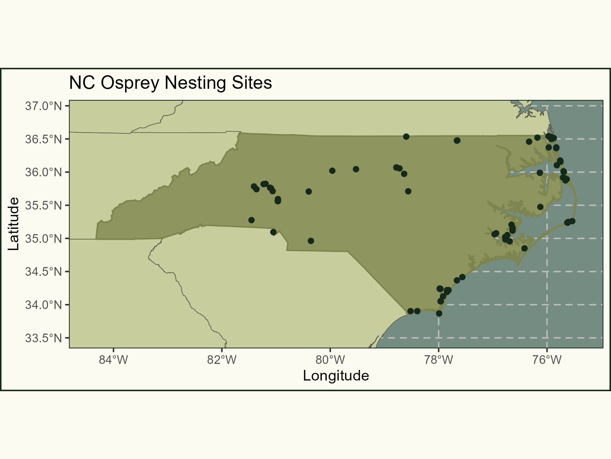

# OsBayes: Bayesian Spatial Analysis of Osprey Nesting Patterns

### Primary Goals:

1. To develop a comprehensive Bayesian framework for modeling osprey nest 
   distributions in North Carolina using Inhomogeneous Poisson Point Processes,
   incorporating environmental covariates and assessing human impact.
2. To apply advanced Bayesian computational tools, specifically Markov Chain Monte 
   Carlo (MCMC) and Stochastic Partial Differential Equation/Integrated Nested Laplace
   Approximation (SPDE/INLA), for robust spatial inference and prediction.
3. To quantify uncertainty in model predictions and evaluate the influence of spatial
   autocorrelation, environmental heterogeneity, and sampling bias on the modeled 
   osprey nesting patterns.
4. To validate and refine the model using initial models of osprey observations to 
   inform priors, ensuring ecological validity and enhancing predictive performance.

### Abstract

This independent study is designed to advance the application of Bayesian methodologies 
for analyzing the spatial distribution of osprey nests within the state of North Carolina,
with a focus on integrating Poisson Point Processes with Markov Chain Monte Carlo (MCMC) 
and Stochastic Partial Differential Equation/Integrated Nested Laplace Approximation
(SPDE/INLA). Recognizing the limitations of traditional ecological modeling techniques,
which often neglect the spatial complexity and uncertainty in wildlife data, this research
seeks to employ Bayesian statistics for a more nuanced modeling of spatial dependence and
environmental covariates. By leveraging spatial data the project will explore osprey 
nesting patterns through Bayesian point process models, utilizing MCMC for detailed
parameter estimation and SPDE/INLA for computational efficiency.

A novel aspect of this study involves the preliminary use of Bayesian models fitted on
osprey observation data to derive priors for the subsequent nesting model. This approach
aims to utilize the informative potential of recorded osprey sightings, under the 
hypothesis that these observations can provide indirect insights into nesting preferences.
Through rigorous testing, including sensitivity analysis and model comparison, this 
strategy seeks to justify the use of observation-derived priors, thereby enriching the 
model with ecologically valid assumptions and enhancing its predictive capacity.

The research will address data preprocessing challenges, such as the transformation of
observational data and feature extraction from environmental covariates, while also
innovating in the use of accessibility metrics to mitigate observation bias. Model
development will focus on the careful selection of priors and the integration of
environmental and anthropogenic factors, aiming for enhanced predictive accuracy. The
project will culminate in uncertainty quantification and the formulation of conservation
strategies informed by the model outcomes.

### Expected Outcomes:

1. **Enhanced Methodological Framework**: The establishment of an advanced Bayesian 
   modeling framework that incorporates observation-derived priors for osprey nesting
   patterns, showcasing the integration of MCMC and SPDE/INLA in ecological studies. This
   approach aims to provide a profound understanding of spatial processes and serve as a
   methodological benchmark.
2. **Robust Uncertainty Quantification**: The achievement of a thorough quantification of
   uncertainties associated with predictions, incorporating the novel aspect of
   observation-derived priors to address spatial heterogeneity and autocorrelation. This
   will contribute significantly to the reliability of conservation planning and habitat
   management decisions.
3. **Conservation and Management Insights**: The derivation of targeted conservation
   strategies through the identification of key environmental and anthropogenic factors
   influencing osprey nesting sites, leveraging a model refined by observation-informed
   priors. These insights can be used to inform evidence-based policies for osprey
   population and habitat protection, underscoring the practical implications of Bayesian
   spatial modeling in wildlife conservation.
   
### Data

- **Osprey Nesting Data**: [eBird (The Cornell Lab of Ornithology)](https://ebird.org/data/download)
- **Osprey Observation Data**: [Osprey Watch](https://www.solertium.com/work/ospreywatch)
- **Possible Model Covariates**:
  * [Distance from Coast](https://oceancolor.gsfc.nasa.gov/resources/docs/distfromcoast/)
  * [Distance to Water Body](https://www.arcgis.com/home/item.html?id=89eda98cf524461c800d88415a851d00)
  * [Elevation (DEM)](https://www.sciencebase.gov/catalog/item/5540e111e4b0a658d79395d9)
  * [Canopy](https://www.mrlc.gov/data)
  * [Urban Imperviousness](https://www.mrlc.gov/data)
  * [Land Cover](https://www.mrlc.gov/data)
  * [EVI](https://ladsweb.modaps.eosdis.nasa.gov/missions-and-measurements/products/MOD13A3/#overview)
  * [Weather](https://www.nacse.org/prism)
